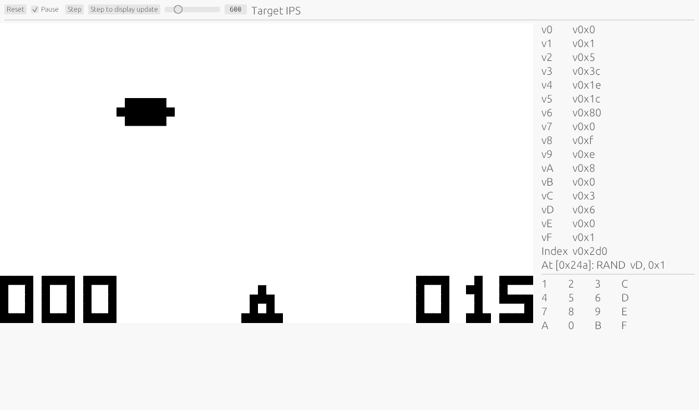

# CHIP8

An emulator for CHIP8. Also includes some elements of a static analyzer.

## Quick start

Run `cargo run -- run <filename>` to open the emulator with a rom loaded. There is a number of ROMs included in the `GAMES` directory.

For example: `cargo run -- run GAMES/UFO.ch8`

Run `cargo run -- -h` for the rest of the options.
